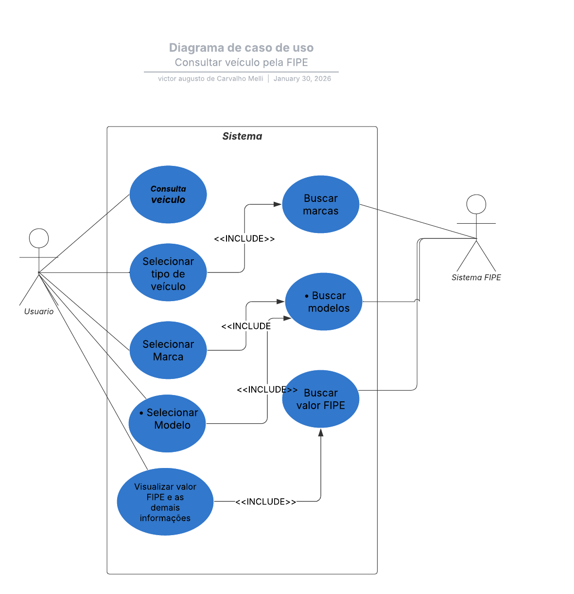

# Consulta Tabela FIPE – Java

Projeto desenvolvido para consultar o valor de veículos com base na Tabela FIPE,
permitindo ao usuário buscar carro, moto ou caminhão por marca, modelo e ano, exibindo
os valores de mercado disponíveis para cada opção.

Este projeto demonstra o consumo da API pública da FIPE, manipulação de dados com
Streams e uso de expressões lambda para filtragem e ordenação.

---

## 🚩 Objetivos do projeto

- Permitir ao usuário selecionar o tipo de veículo (carro, moto ou caminhão)
- Listar as marcas disponíveis para o tipo escolhido
- Listar os modelos disponíveis de uma marca selecionada
- Filtrar modelos pelo nome
- Buscar os valores FIPE por ano de fabricação
- Exibir os resultados filtrados conforme o ano informado pelo usuário

---

## 🛠️ Tecnologias utilizadas

- Java 17
- Maven
- API pública da Tabela FIPE
- Biblioteca Jackson para manipulação de JSON
- Streams e Lambda Expressions do Java

---

## 📌 Como funciona

O programa é executado no terminal e segue os passos abaixo:

1. O usuário escolhe o tipo de veículo
2. A aplicação consulta as marcas disponíveis
3. O usuário informa o código da marca desejada
4. O programa exibe os modelos dessa marca
5. O usuário informa parte do nome do modelo para filtrar
6. O usuário informa o código do modelo
7. O programa busca e exibe os valores FIPE para todos os anos
8. O usuário pode declarar um ano para filtrar os resultados

---

## 📐 Diagramas

Foram utilizados diagramas para planejar o fluxo da aplicação:

- Diagrama de Caso de Uso
- Diagrama de Classes

  

---

## 🚀 Exemplo de uso

## 🎓 Contexto do curso

Projeto desenvolvido como desafio prático do curso  
**Java: trabalhando com lambdas, streams e Spring Framework**,  
da plataforma **Alura**, com foco em consumo de APIs, modelagem de dados e uso de Streams. :contentReference[oaicite:1]{index=1}

---

## 🧾 Licença (opcional)

Esse projeto está sob MIT License (ou outra licença que você escolher).